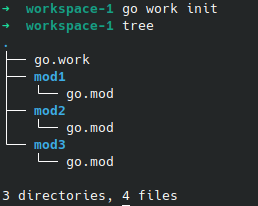

# Introduction
Go 1.18 added the workspace mode to Go, allowing you to work on multiple modules simultaneously without having to edit the go.mod file.

_Module is a folder having `go.mod` file_

Earlier if you are working with multiple modules the flow would look like below
1. Make the change in module1.
2. Update the go.mod file of module2 with `replace` directive for your local, unpublished changes.
3. Make the changes in module2.
4. Before pushing to remote remember to remove the `replace` from the `go.mod`.

What workspace allows you to do is allow you to access the changes from module1 in module2 without updating the `go.mod` files.
Thus allowing developers to fully focus on writing code, only when you are going to complete your local development flow and are going to push to remote, we need to update the version tag of module1 in module2's go.mod file.

## How to Setup Go Workspace
Setting it up is even simpler.
1. Create a folder that will contain all your modules that you want to be part of a workspace, we will name it `workspace-1`
2. Add your modules to this folder. Your folder structure will look something like this.


3. Now, assuming you are using Go version > 1.18 (i recommend the latest stable version)
4. Execute `go work init` in the `workspace-1` directory.
5. This will create a `go.work` file for you, which will have the go version it is using. 



6. In the `go.work` file add the following
    ```go
    go 1.21.6

    use (
        ./mod1
        ./mod2
        ./mod3
    )
    ```
    Here I am using go 1.21.6 and I am giving a relative path to the go.mod files in all my modules that I want in this workspace.
7. The End. 
 
Now you can make changes in mod1 and those changes will be reflected in other modules part of this workspace, in this case mod2 and mod3.

As you progress and add new modules, go will also create a `go.work.sum` file similar to `go.sum` it will be auto-generated, so we don't have to touch it.

## Conclusion

I am using workspaces extensively, allowing me to focus on writing code without modifying other unwanted files. It also allows me to use a single instance of an IDE where I can get a complete picture of all the changes I have made in different modules. Thus reducing resource consumption, switching multiple windows, and ease of tracking changes all across the project.

Hope you start using this tool to increase your productivity.

For a detailed article, do visit the official blog [here](https://go.dev/blog/get-familiar-with-workspaces)

If you like my article or want to share some insight, feel free to reach out to me.