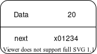
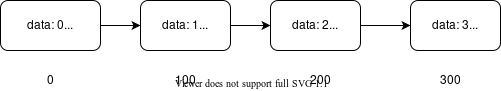

In this post we are going to look at

- **What** are Data Structures and Abstract Data Types
- **Why** do we need them
- **How** can we create our own simple ADT

Let's get started

## What are Data Structures and Abstract Data Types and Why do we need them

In any program there are lots of operations being performed ranging from simple addition to complex ones. These operations have a very basic thing in common regardless of their scale.

1. They get input from somewhere (read)
2. They perform the necessary operation
3. They write the new result obtained after the operation (write)

If we observe we find that 2 out of 3 steps we are doing something with the memory or storage.

The 2nd step is also very important because even if we say that we have optimized the read and write the performing of the operation can take a considerable amount of time also if the operation is brute forced then even if the read, write is optimized the frequency of read, write can be an issue. Thus for the 2nd step we have [Algorithms](https://en.wikipedia.org/wiki/Algorithm).

The 1st and the 3rd steps can be done efficiently by proper data organization, management and the storage format of the data.

> a data structure is a data organization, management, and storage format that enables efficient access and modification. More precisely, a data structure is a collection of data values, the relationships among them, and the functions or operations that can be applied to the data, i.e., it is an algebraic structure about data. - Wikipedia

So now we know what a data structure is, this forms the base to learn about the Abstract Data Types (ADT).

We know that a particular thing can be done in various different manners. This also applies to the data structures which can be implemented in various ways. For example Stack a Last In First Out (LIFO) structure has three operations defined push(insert element), pop (remove element), peek(fetch element). So you can use any underlying data structure you want and if you implement these three operations no matter how complex the implementation is it will be a stack ADT.

So I can use a chain of nodes (Linked List), doubly linked list (which has 2 pointers one for the next node and one for the previous node [data, next, prev]), But if i implement the 3 operations which makes it behave like stack(LIFO) then that is called an abstract stack.

Thus we see that even though the internal structure of type varies they all provide an interface that is almost same in all the languages i.e. way to add an item, remove an item, create a new instance of the data structure and read from the structure.

This type of abstraction gives us the ability to think beyond the implementation details of the concrete data and allow us to view the type in terms of its behavoir, possible operations on the data of this type.

> An abstract data type is defined by its behavior (semantics) from the point of view of a user, of the data, specifically in terms of possible values, possible operations on data of this type, and the behavior of these operations. This mathematical model contrasts with data structures, which are concrete representations of data, and are the point of view of an implementer, not a user. - Wikipedia

## How can we create our own simple ADT

To create an ADT lets take a very simple structure that will be the fundamental structure for a lot of other complex structures

```go
struct node {
    data int
    next *node
}
```

Here we see that we have a group of 2 different types one is `data` which can be any type but for simplicity we take it as an integer, the 2nd one i.e. `next` is a pointer that points to the another `node`.




Here for simplicity the address of the next node is assumed to be 0, 100, 200, 300

Now we have data structure that has a way to store some data and to link one
data instance to the other using the `next` field.

To make an ADT out of it we need to abstract the implementation to do that we provide some operations on the data structure.

We can define the following operations

1. GetData
2. SetData
3. GetNext
4. SetNext

and a function that gives us a new instance of the type

```

function GetData(n node) int {
    return n.data
}

function SetData(n *node, v int) {
    n.data = v
}

function GetNext(n node) {
    return n.next
}

function SetNext(n *node, next *node) {
    n.next = next
}

function NewNode(data int, next *node) *node {
    return &node{data, next}
}
```

To create a chain of nodes we can use

1. `NewNode` to create a new node.
2. Do `SetNext` on the current node to point to the address of the new node created.
3. Repeat 1 and 2

To read a nodes data we use `GetData`, to read the address of the next node we use `GetNext`

The internal implementation of these functions can be complex and complicated but for a user they do not have to think about that, they just need to call these functions.

## Conlusion

In this post we saw what is a data structure and a Abstract Data Type, Why do we need them and how to implement one.

Share the post if you learnt something and Do share your feedback.
