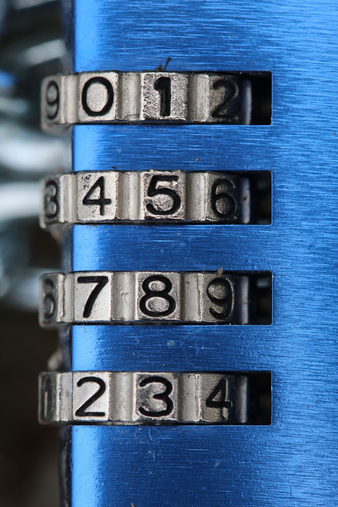

## Number Systems

Here we are going to take a look at the following Number systems which are used extensively in computer science

- Decimal
- Binary
- Octal
- Hexadecimal

### Introduction

Basically, all the systems are used for counting, thus allowing humans to measure things.

Every system that we are going to see will have a radix/base.

**Radix / Base** - the number of unique digits, including the digit zero, used to represent numbers [[1]](https://en.wikipedia.org/wiki/Radix)

**Example:** Decimal is base-10 because it contains 10 unique digits to represent numbers. They are
0,1,2,3,4,5,6,7,8,9

Let's start

### Decimal [[2]](https://en.wikipedia.org/wiki/Decimal)

We now know that the system has a base of 10 and includes 10 unique symbols which are 0,1,2,3,4,5,6,7,8,9.

Now we can count from 0-9, but how do we represent _10_?

This is where the base comes to our rescue, to do that we can write it as 101.

**Note:** All we have is 0-9, and we know the base of the system. We can now represent all numbers using these two fundamental pieces of information.

How can we represent 3241 using only the 2 things we know? Let's see

1 -> 100 (1)

4 -> 101 \* 4 (40)

2 -> 102 \* 2 (200)

3 -> 103 \* 3 (3000)

Summing them up 3000 + 200 + 40 + 1 will give us our result.

Another interesting point to note here is that `3` is the 4th digit from the right, but we raise 10 with only 3 and `1` is the 1st digit from the right, and we raise 10 with 0.

Because to represent 0-9 we need only 0 to 9 (101 - 1), to represent 40 we only need the range 101 to 99(102 - 1), to represent 200 we need the range from 102 to 999(103 - 1), similarly for 3000 we need 103 - 9999(104 - 1) and so on.

This fundamental logic is used in the other systems which we are going to see.

### Binary [[3]](https://en.wikipedia.org/wiki/Binary_number)

This system has a base of 2 (this is what we mean by **bi** in binary) and includes 2 unique symbols which are 0,1.

As we can see, we can only represent 2 numbers, they are 0 and 1.

To represent other numbers we are going to use the base as we did in the previous section.

How do we represent _2_?

We will again expand the numbers and represent them using the base.

0 -> 0

1 -> 20

now to represent 2 we can simply add 1 + 1, that will look like this

| Operation | Value |   Representation    |
| :-------: | :---: | :-----------------: |
|           |  01   |   (20)   |
|     +     |  01   |   (20)   |
|     =     |   2   | (21 + 0) |

But 2 is not available in the binary symbol set then how can we represent it using only 0's and 1's

In decimal, if we add 9 + 1 = 10 this happens because

> When the available symbols for this position are exhausted, the least significant digit is reset to 0, and the next digit of higher significance (one position to the left) is incremented (overflow), and incremental substitution of the low-order digit resumes. This method of reset and overflow is repeated for each digit of significance.

The least significant digit is the one on the extreme right.

Thus, when we do 01 + 01 we have exhausted all the symbols thus we write 2 as 10 with the least significant digit reset to 0 and the higher significant digit is increment to 1 giving us 10.

**Note:** 0s on the left side does not mean anything, so one can add as many 0s they want on the left side so
1 can be written as 01, 001, 0001.

### Octal [[4]](https://en.wikipedia.org/wiki/Octal)

This system has a base of 8 (this is what we mean by **oct** in octal) and includes 8 unique symbols which are 0,1,2,3,4,5,6,7.

How do we represent _8_?

7 + 1 = 10 (reset the least significant digit to 0 increment the higher significant digit)

8 -> 81

### Hexadecimal [5](https://en.wikipedia.org/wiki/Hexadecimal#Elementary_arithmetic)

This system has a base of 16 (hexa - 6 deci - 10 = 16) and includes 16 unique symbols which are 0,1,2,3,4,5,6,7,8,9, A, B, C, D, E, F, where 'A' - 'F' or 'a' - 'f' represents a number from 10 to 15.

How do we represent _16_?

F + 1 = 10 (reset the least significant digit to 0 increment the higher significant digit)

10 -> 161

Let's take some examples and see how few sample numbers will be represented in all the above systems introduced.

| Decimal | Binary  | Octal | Hexadecimal |
| :-----: | :-----: | :---: | :---------: |
|    4    |   100   |   4   |      4      |
|    6    |   110   |   6   |      6      |
|    8    |  1000   |  10   |      8      |
|   16    |  10000  |  20   |     10      |
|   99    | 1100011 |  143  |     63      |

Representation using base

| Value In Decimal |              Decimal (10)               |                                                                                          Binary (2)                                                                                          |                                    Octal (8)                                    |                    Hexadecimal (16)                    |
| :--------------: | :-------------------------------------: | :------------------------------------------------------------------------------------------------------------------------------------------------------------------------------------------: | :-----------------------------------------------------------------------------: | :----------------------------------------------------: |
|        20        | 101 _ 2 + 100 _ 0 |                            10100  24 _ 1  + 23 _ 0  + 22 _ 1  + 21 _ 0  + 20 \* 0                            |              24  81 _ 2  + 80 _ 4               | 14  161 _ 1  + 160 _ 4 |
|        85        | 101 _ 8 + 100 _ 5 | 1010101  26 _ 1  + 25 _ 0  + 24 _ 1  + 23 _ 0  + 22 _ 1  + 21 _ 0  + 20 \* 1 | 125  82 _ 1  +81 _ 2  + 80 \* 5 | 55  161 _ 5  + 160 _ 5 |

**Notice** how as the base increases, the number of digits required to represent the same value reduces. Also notice the power of the base increases as we go from right to left.

To generalize it

If we have a system with **base - b** and value being **xyz** it will be represented as
**b2 _ x + b1 _ y + b0 \* z**.

Here `n` i.e. the number of digits is 3 so above expression can be written as
**b(n-1) _ x + b(n-2) _ y + b(n-3) \* z**.

All the numbers can be converted from one system to another with help of the bases.

### Conclusion

In this post, we have revised the number systems. In the next post, we will see how we can convert from a number system to another.

Here is a PDF with detailed examples and some additional concepts

[Number_Systems.pdf](Number_Systems_1.pdf)

Do share your feedback by contacting me.

### References

1. https://en.wikipedia.org/wiki/Radix
2. https://en.wikipedia.org/wiki/Decimal
3. https://en.wikipedia.org/wiki/Binary_number
4. https://en.wikipedia.org/wiki/Octal
5. https://en.wikipedia.org/wiki/Hexadecimal#Elementary_arithmetic
