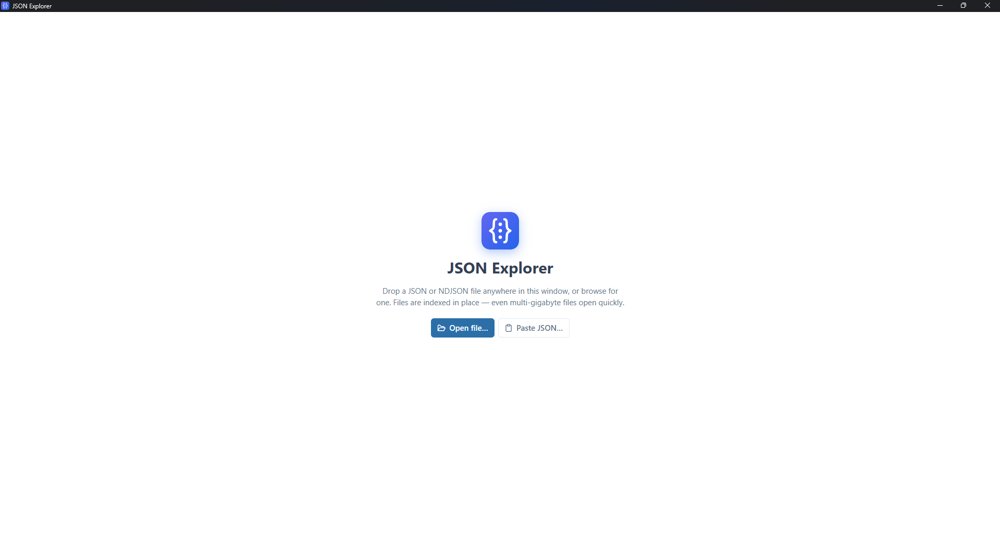
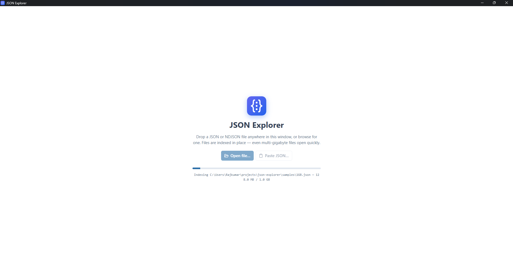
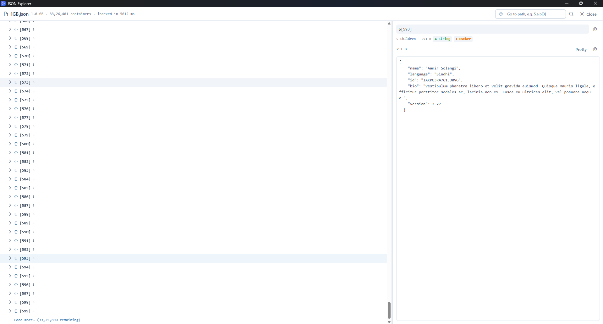
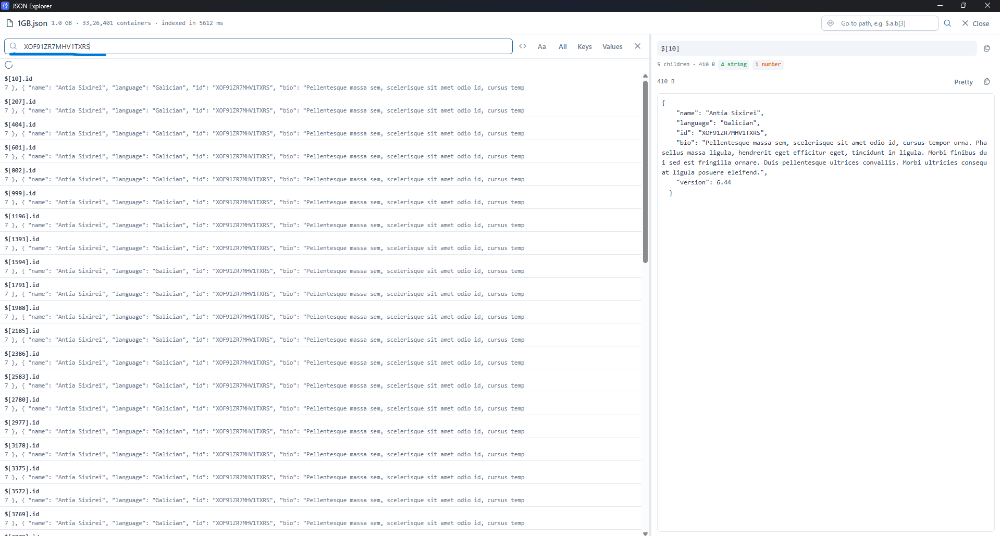
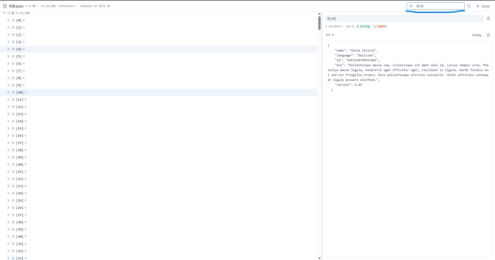

<p align="center">
  
</p>

<h1 align="center">JSON Explorer</h1>

<p align="center"><strong>Open the JSON file your editor can't.</strong><br>
Drop in a multi-gigabyte JSON or NDJSON file and browse it in a fast, virtualized tree — no waiting for the whole thing to load.</p>

<p align="center">
  <a href="https://github.com/rajkumarGosavi/json-explorer/releases/latest" target="_blank" rel="noopener noreferrer"><strong>⬇️ Download latest</strong></a> ·
  <a href="https://github.com/rajkumarGosavi/json-explorer" target="_blank" rel="noopener noreferrer">Source on GitHub</a> ·
  <a href="https://github.com/rajkumarGosavi/json-explorer/issues" target="_blank" rel="noopener noreferrer">Report an issue</a>
</p>

---

## Why this project was needed

Working with data means constantly running into JSON files that are too big to open — an API dump, a database export, a log of NDJSON events. Every obvious tool falls over: the text editor freezes, the browser tab crashes, `jq` gets you a slice but not a way to *browse*, and "online JSON viewers" are a non-starter for anything sensitive or large. The usual workaround is writing a throwaway script just to peek at the shape of the data — which is a lot of friction for a question as simple as "what's actually in this file?"

The core problem is that almost every viewer tries to parse the entire document into memory before showing you a single line. That works fine at a few megabytes and collapses at a few gigabytes.

JSON Explorer takes the opposite approach: it **indexes the file in place**. It scans the byte offsets of every container once, then reads only the slice you're actually looking at. Even 1 GB+ files open in seconds, memory stays flat no matter how big the file is, and nothing ever leaves your machine — so you can point it at a huge production export and just *look*.

- 🗂️ **Handles huge files** — millions of containers indexed in seconds; 33 M+ indexed in ~5.6 s.
- 📄 **JSON & NDJSON** — drag-and-drop, browse for a file, or paste JSON directly.
- 🔍 **Search keys and values** — case-sensitive and regex modes, with hit-by-hit navigation.
- 🎯 **Go to path** — jump straight to any node with a JSON path like `$.a.b[3]`.
- 🔎 **Inspector pane** — pretty-printed values, byte size, child count, and a type breakdown.
- ⌨️ **Keyboard-first** — navigate the tree and copy values without touching the mouse.

## How it works

1. **Point it at a file** — drop it anywhere in the window, pick it with the file browser, or paste raw JSON.
2. **It indexes in place** — a single pass records where every object and array lives, without loading the document into memory.
3. **Browse a virtualized tree** — only the visible rows are rendered, so scrolling stays smooth through millions of nodes.
4. **Search, jump, inspect** — find keys or values across the whole file, jump to a path, and read any node in the inspector.

## Download

| Platform | File | Get it |
|---|---|---|
| **Windows 10/11** | `.msi` installer | [Download](https://github.com/rajkumarGosavi/json-explorer/releases/latest) |
| **macOS** | `.dmg` (Apple Silicon / Intel) | [Download](https://github.com/rajkumarGosavi/json-explorer/releases/latest) |
| **Linux** | `.AppImage` / `.deb` | [Download](https://github.com/rajkumarGosavi/json-explorer/releases/latest) |

## Screenshots

### Open a file

Drop a file anywhere, browse for one, or paste JSON directly.

<p align="center">
  
</p>

### Indexed in place

A 1 GB file being indexed — no full load into memory.

<p align="center">
  
</p>

### Explore the tree

Virtualized tree beside the inspector — 33 M+ containers indexed in ~5.6 s.

<p align="center">
  
</p>

### Search values

Search across the whole file, with matching paths and previews.

<p align="center">
  
</p>

### Jump to a path

Go straight to any node by its JSON path.

<p align="center">
  
</p>

## Install

Grab the build for your OS from the [latest release](https://github.com/rajkumarGosavi/json-explorer/releases/latest): Windows `.msi`, macOS `.dmg` (Apple Silicon and Intel), or Linux `.AppImage` / `.deb`.

The app isn't OS-code-signed yet, so the first launch shows an "unknown publisher" warning — a *reputation* prompt, **not** a virus detection. New independent apps all start here until trust builds up.

- **Windows** — on **"Windows protected your PC"** click **More info → Run anyway**.
- **macOS** — right-click the app → **Open** → **Open**. If it says the app is *"damaged"*, clear the download quarantine flag once in Terminal:

  ```bash
  xattr -dr com.apple.quarantine "/Applications/JSON Explorer.app"
  ```

- **Linux (.AppImage)** — make it executable, then run:

  ```bash
  chmod +x JSON\ Explorer_*.AppImage
  ```

## FAQ

**How big a file can it open?** Multi-gigabyte files are the point — it indexes byte offsets instead of loading the document, so file size is bounded by disk, not RAM.

**Does my data leave my machine?** No. It's a local desktop app; the file you open never leaves your device.

**JSON and NDJSON both?** Yes — regular JSON documents and newline-delimited JSON (one record per line).

**Is it open source?** Yes, MIT licensed. [Read the source](https://github.com/rajkumarGosavi/json-explorer).

**Built with?** Tauri 2, Vue 3 and Rust.

---

<p align="center"><sub>JSON Explorer is provided "as is", without warranty. MIT licensed. © 2026.</sub></p>

<style>
.lb-overlay{position:fixed;inset:0;z-index:9999;display:none;align-items:center;justify-content:center;background:rgba(0,0,0,.88);padding:2vmin;cursor:zoom-out;}
.lb-overlay.open{display:flex;}
.lb-overlay img{max-width:96vw;max-height:96vh;width:auto;height:auto;border-radius:8px;box-shadow:0 12px 48px rgba(0,0,0,.6);}
.lb-overlay .lb-close{position:fixed;top:14px;right:20px;font-size:34px;line-height:1;color:#fff;opacity:.8;font-family:sans-serif;}
img.shot{cursor:zoom-in;border-radius:10px;border:1px solid rgba(128,128,128,.25);transition:opacity .15s ease;}
img.shot:hover{opacity:.85;}
</style>

<script>
(function(){
  var shots = document.querySelectorAll('img.shot');
  if(!shots.length) return;
  var ov = document.createElement('div');
  ov.className = 'lb-overlay';
  ov.innerHTML = '<span class="lb-close" aria-hidden="true">&times;</span>';
  document.body.appendChild(ov);
  var big = ov.querySelector('img');
  function open(src, alt){ big.src = src; big.alt = alt || ''; ov.classList.add('open'); document.body.style.overflow = 'hidden'; }
  function close(){ ov.classList.remove('open'); document.body.style.overflow = ''; }
  shots.forEach(function(im){
    im.addEventListener('click', function(){ open(im.currentSrc || im.src, im.alt); });
  });
  ov.addEventListener('click', close);
  document.addEventListener('keydown', function(e){ if(e.key === 'Escape') close(); });
})();
</script>
