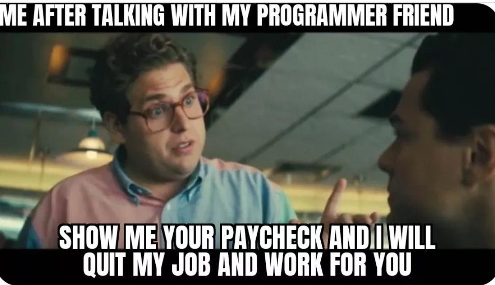

# Introduction

Yes, I believe that before we even step foot in the arena, we should take a reality check. So let's examine them.

## 1. Software engineering is easy.

The short answer **NO**.

- There are literally too many factors to consider while working on a particular thing.

- There won't be a perfect decision, no perfect technical design document, and no perfect product requirement document.

- The next year, there will be hype about another new framework that everyone must know and use because, why not?

- Your code will break in production, and end users using your feature will be negatively impacted.

- There will be deadlines for things that are of the highest priority (always, even the ones that won't even reach production).

- Mental health and physical health can be negatively impacted. Stress and burnout are common.

## 2. Good salaries

As of now, 2023–2024, the market has slowed down significantly. There was a boom in software jobs from 2019–2021, as many companies overhired. Then came mass layoffs because they realised they had overhired, along the advent of AI.

Companies now have AI options available, and AI is still improving, so you have to be quite skilled in whatever you are doing.

For the salary part, there are cycles in the market where you get a great salary and times when you get average or below-average salaries. So plan accordingly.

You don't have control over most parts; all you can do is upskill, show your skills, and negotiate (there is always room to negotiate).

## 3. Work-life balance
There is no such option; you have to make decisions on what is important to you and how to utilise your time effectively.

Remember, you are trading your time and knowledge for money.

Unlike in the past, where they literally had to hunt for food every day and stay in a cave, and they were mostly content with it, there will be desires, dreams, and family that will also be factors in your decision.

Your passions and hobbies can be a driving force, but again, you have to make the decisions; you are the best defence against yourself.

Often times, you will fall down the rabbit hole, and you have to pull yourself up.

***I will be adding more points to this post in the future as well.***

